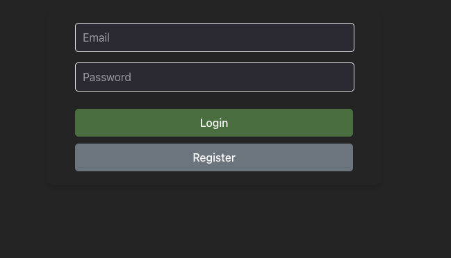
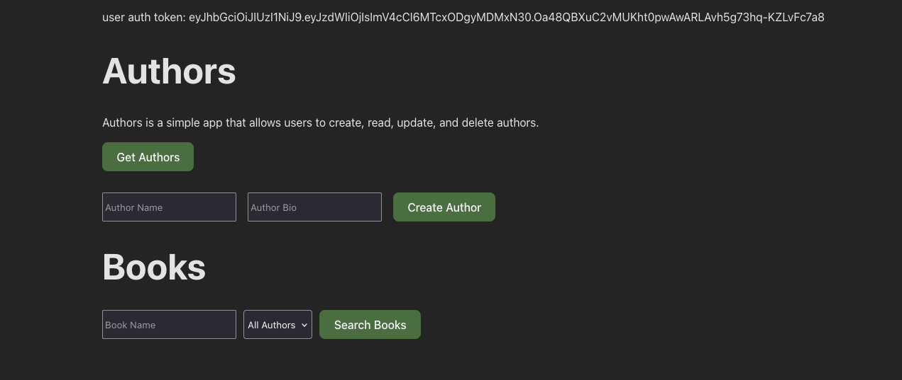
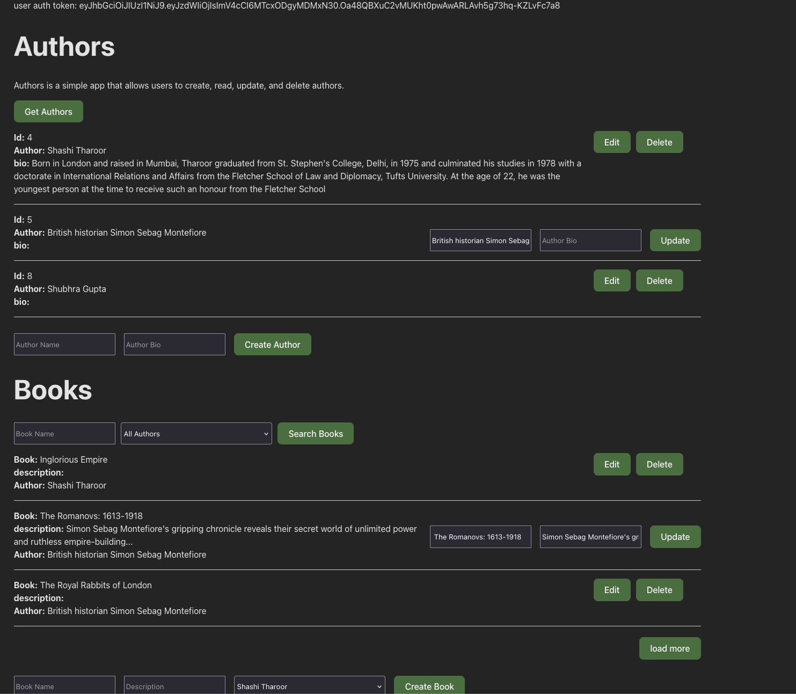

 # An example of a simple web application with a microservices architecture

## 🛠 Stack

Backend

- Language: Ruby 3.0.0
- Framework: Rails 7.1.3
- API Protocol: Rest
- Database: Postgres

Frontend

- Yarn
- Vite
- React

## 🚀 Developer Quick start

For user microservice

1. run command `cd user_microservice`
1. run command `bundle install`
1. run command `rails db:create`
1. run command `rails db:migrate`
1. run command `PORT=3000 bundle exec puma -C config/puma.rb`

For post microservice

1. run command `cd book_microservice`
1. run command `bundle install`
1. run command `rails db:create`
1. run command `rails db:migrate`
1. run command `PORT=3001 bundle exec puma -C config/puma.rb`

For author microservice

1. run command `cd author_microservice`
1. run command `bundle install`
1. run command `rails db:create`
1. run command `rails db:migrate`
1. run command `PORT=3002 bundle exec puma -C config/puma.rb`

For frontend

1. run command `cd frontend`
1. run command `yarn`
1. run command `yarn dev`

## Testing microservices

Open browser and go to `http://localhost:5173`

You should see login and register form as seen in the picture. 

Register and login to see the list of books and authors.

Initially it looks like this

1. Clicking Get Authors will show the list of authors
1. For each author edit and delete buttons are available
1. There is a Create Author button at the bottom to add new author
1. If author has books and you are trying to delete the author, it will first delete all the books associated with the author and then delete the author. (If book microservice is down then author will not be deletedbut and app will log an error message, this isn't handled in the frontend of the app yet)
1. Clicking Search Books will show the list of books with author name if author list is fetched beforehand
1. Filtering books is made with author_id and book title, though it can easily be changed to author name (In this case the book microservice should try to fetch author ids by filtering the name of the author and if not present return an empty array). it has basic pagination and if rows are more than 3 `load more` button will appear at the bottom of the page

Overall all fetched data should like similar to this image

## 📝 Notes

Due to new to microservices architecture to connect microservices together I used http approach which is simple but not the best way to connect microservices. In a real-world scenario, I would use a message broker like RabbitMQ or Kafka to connect microservices together.

During the development I noticed several user auth calls across microservices, and think the best approach would be to use an auth layer from user calls and add a quicker and secure way between microservices, which will be different from the user auth calls. 

What can be improved

1. Test cases can be added for each microservice inner interactions and api calls
1. Error handling can be improved to show user friendly messages
1. on Book creation api instead of providing author_id, author name can be provided and author microservice can be called to get the author id, Same for update request, if author name is not present in author microservice db then create 1 and get the id
1. Remove leftover files and code overall to make the project clean
1. Frontend can be improved to show better UI/UX
